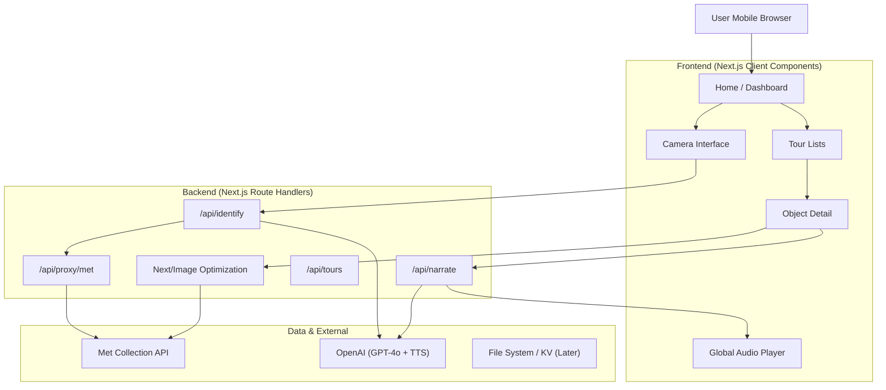

# Met Guide (Web App) — Milestone Plan v2.1

## Guiding Principle

**Ship a working tracer bullet first.** Establish the full path (Database/API → UI → User) immediately. Complexity is added only after the pipeline is flowing.

## Target Outcome

A lightweight, mobile-first web companion for the Met Museum.

- **Core loop**: Browse → Scan/Identify → Listen/Read.
- **Vibe**: “A knowledgeable friend in your pocket,” not a database interface.

## System Architecture

The architecture leverages **Next.js Route Handlers** to mask API keys and normalize data before it hits the client.

## Milestone 0 — The Steel Thread (Scaffold)

**Goal:** A deployed URL that connects to the Met API and renders something dynamic.

### Backend

- `GET /api/health` → returns `{ status: "ok", env: "production" }`
- `GET /api/object/random` → fetches one hardcoded object ID (e.g., *The Temple of Dendur*) to prove connectivity.

### Frontend

- Setup **Tailwind CSS** with a mobile container constraint (`max-w-md mx-auto`).
- Home page renders the “Random Object” title and image.
- **Crucial:** Configure `next.config.js` `remotePatterns` to allow Met museum image domains (essential for `next/image`).

### Test Checklist

- [ ] Deployed to Vercel (or similar).
- [ ] Mobile layout viewports are correct (no horizontal scroll).
- [ ] API keys (`MET_API`—if needed, `OPENAI_KEY`) are reading from environment variables.

## Milestone 1 — The Object Experience (Foundation)

**Goal:** A fast, stable, and beautiful object detail page.

### Technical Strategy

- **Data fetching:** Use **SWR** or **TanStack Query** on the frontend to standardize loading + error states and get stale-while-revalidate caching (especially useful for “Back” navigation).
- **Image strategy:** Use `next/image` with a placeholder blur or skeleton loader (critical for perceived performance on museum Wi‑Fi).

### Frontend

- `app/objects/[id]/page.tsx`
- **UI elements:**
  - Sticky header with “Back”.
  - Image with “pinch to zoom” capability (standard CSS/JS).
  - Title, Artist, Date (handle `null` values gracefully).

### Test Checklist

- [ ] Skeleton loader appears while fetching.
- [ ] 404 handled gracefully (if ID doesn’t exist).
- [ ] Layout Shift (CLS) is minimized during image load.

## Milestone 2 — Highlights Tour (The Content)

**Goal:** Users have a curated path to follow.

### Tour Generation (Offline/Build-time)

- `scripts/generate-tours.ts`:
  - Fetches objects via search: `isHighlight=true & hasImages=true`.
  - **Filtering:** aggressively cull objects with missing artist names or bad metadata.
  - Output: `data/tours.json` (committed to git).

### Backend

- `GET /api/tours`: Reads from the local JSON file. Fast and free.

### Frontend

- `app/tours/highlights/page.tsx`: A vertical list or masonry grid of “Tour Cards.”
- **Tour card:** Thumbnail + Title + “View Object” button.

### Test Checklist

- [ ] Tour generates < 1MB JSON file.
- [ ] Images in the list are lazy-loaded.

## Milestone 3 — Department Tours (Breadth)

**Goal:** “I like Egyptian Art, show me that.”

### Logic

- Reuse the generation script logic but parameterize by `departmentId`.
- Limit to top 30 objects per department to keep build times fast.

### Frontend

- `app/tours/departments/page.tsx`: Simple list of departments.
- `app/tours/departments/[id]/page.tsx`: Reuses the Highlights component logic.

### Test Checklist

- [ ] Navigation depth: Home → Dept List → Specific Dept → Object → Back works smoothly.

## Milestone 4 — Narration & Synthesis (The “AI Guide”)

**Goal:** Text that sounds like a guide, not a textbook.

### Backend (`/api/narrate`)

- **Prompt engineering:**
  - Input: Title, Artist, Medium, Date, Classification.
  - Instruction: “You are an enthusiastic museum guide. Write a 45-second script. Focus on why this matters, not just dimensions.”
- **Caching:**
  - Check `cache/narrations/{id}.json` (or an in-memory `Map` for dev).
  - If missing, call OpenAI → save to cache → return.

### Frontend

- “Guide” tab or section on the Object page.
- Stream the text response if possible (feels faster), or show a spinner.

### Test Checklist

- [ ] Prompt costs are calculated (track token usage).
- [ ] Hallucination check: avoid inventing historical facts (set `temperature` to 0.2 or 0.3).

## Milestone 5 — The “Scan” Feature (Complexity Spike)

**Goal:** Connect the physical world to the digital app.

### The “Two-Step” Search Architecture

1. **Vision analysis (OpenAI gpt-4o):**

   - Prompt: “Identify the artwork in this image. Return JSON with fields: `visual_keywords` (list), `probable_artist`, `probable_title`, `is_artwork` (boolean).”

2. **Met search (Met API):**

   - Construct a search query using `probable_artist` OR specific `visual_keywords`.
   - Filter results by `hasImages=true`.

3. **Client re-ranking:**

   - Display top 3 matches to the user.

### Frontend (`app/scan/page.tsx`)

- Standard `<input type="file" capture="environment">`.
- **Crucial UI:** “Identifying...” loading state must be entertaining (fun fact or simple animation) because this will take ~3–6 seconds.

### Test Checklist

- [ ] “No match found” flow is frustration-free (offers manual text search).
- [ ] Image resize before upload (don’t send 5MB raw photos to OpenAI; resize to ~800px width client-side first).

## Milestone 6 — Production Hardening

**Goal:** Reliability and Audio.

### Audio (TTS)

- Implement **OpenAI TTS**.
- **Store strategy:** Do not stream TTS directly to client for MVP (too hard to cache). Generate MP3 on server → save to tmp/blob → serve URL.
- **UI:** Persistent audio player footer (React Context) so audio continues while browsing.

### Performance

- **Rate limiting:** Use `upstash/ratelimit` (or similar) on `/api/identify` to prevent wallet-draining abuse.

## Technical “Gotchas” & Decisions

| Decision | Approach | Why? |

|---|---|---|

| **State manager** | **SWR / TanStack Query** | Handles caching, loading states, and re-fetching automatically. |

| **Styling** | **Tailwind CSS** | Faster iteration for mobile responsiveness. |

| **Image hosting** | **Met URL + Next/Image** | Met provides URLs, but they’re unoptimized; `next/image` is important for performance. |

| **API safety** | **Server-side only** | Never expose OpenAI keys in client code. All AI calls go through Route Handlers. |

| **Uploads** | **Client-side compression** | Use `browser-image-compression` to shrink photos before POSTing. |

## Why these changes were made (rationale)

1. **Client-side data fetching (SWR/React Query):** simplifies caching, loading states, and “Back button” performance compared to bespoke `fetch` + `useEffect`.
2. **Refined scan logic:** “Vision → Keywords → Search” is more reliable than asking the LLM to directly map to Met object IDs.
3. **Image optimization:** `next.config.js` `remotePatterns` is essential because Met images are often multi‑MB.
4. **Audio persistence:** global player avoids a common museum-app frustration: audio stopping when navigating.
5. **Client-side compression:** saves bandwidth and speeds up Vision calls.